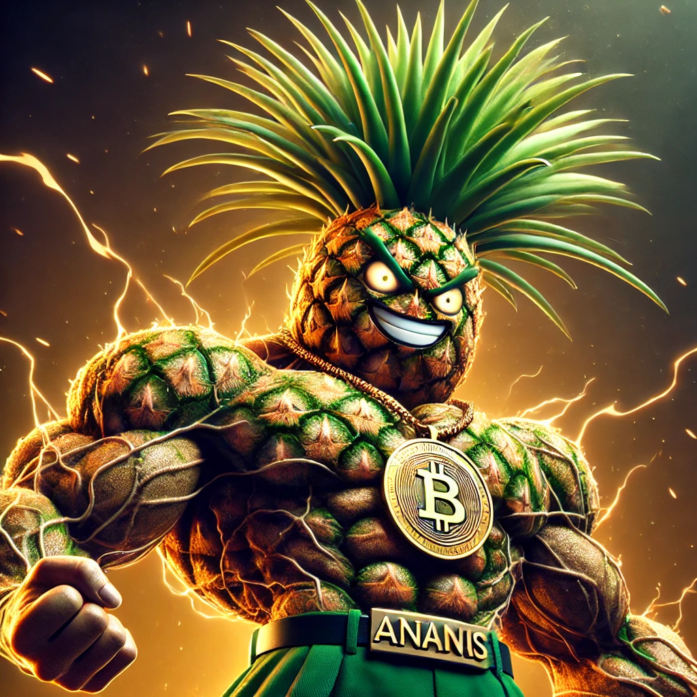

# Ananas Token (ANNS) for Etherium Blockchain

### Desc

This is an ERC20 token for students of course Blockchain HSE. All trust is held by teachers. They get it through solving tasks,
and then can use it for various purposes.

### Mascott

This is token's mascott.

